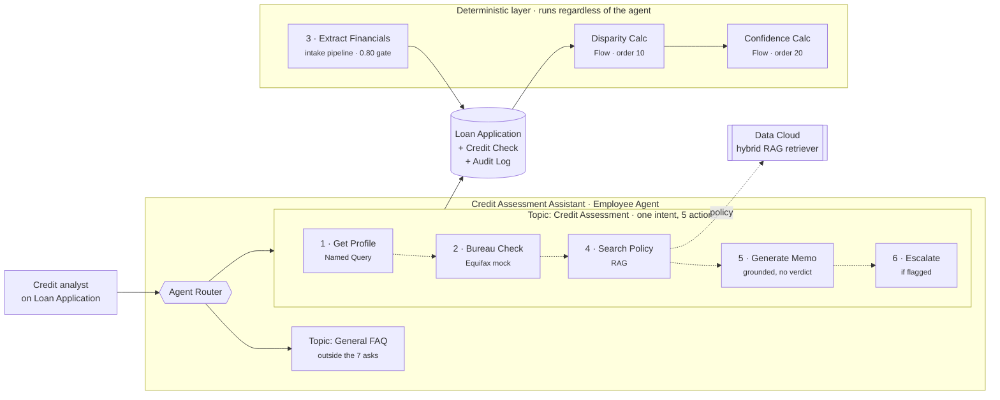
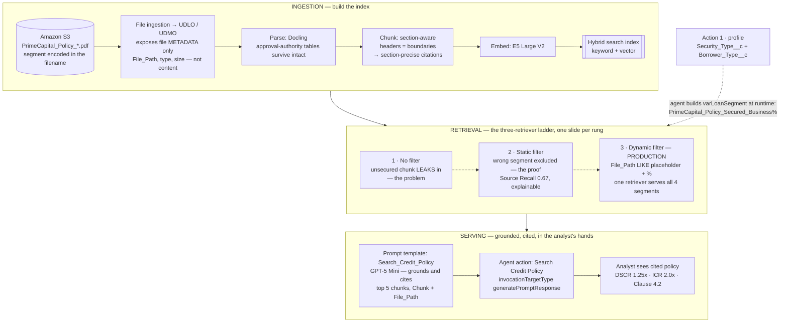
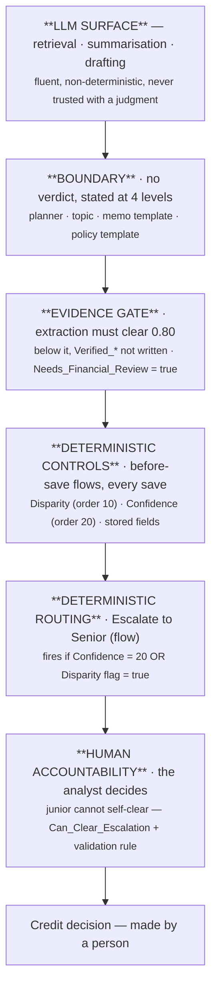
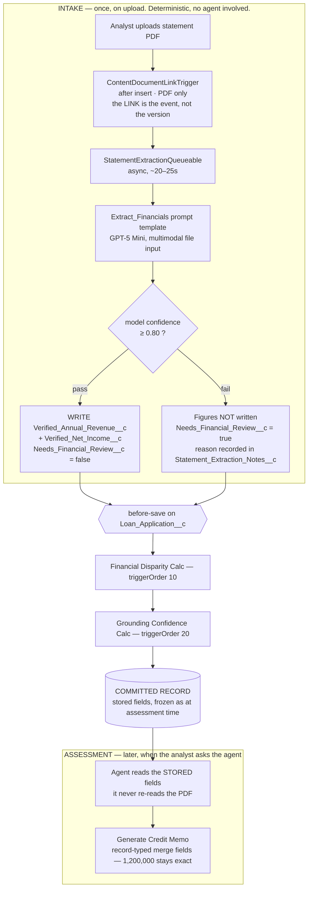
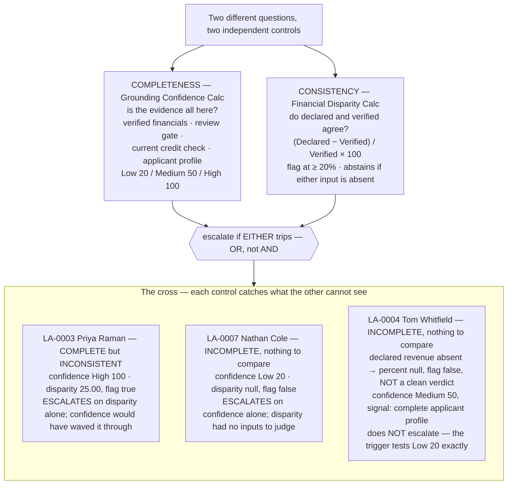
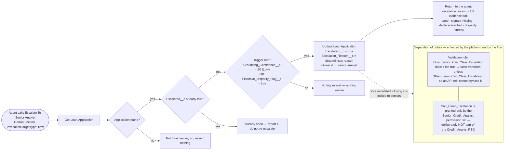
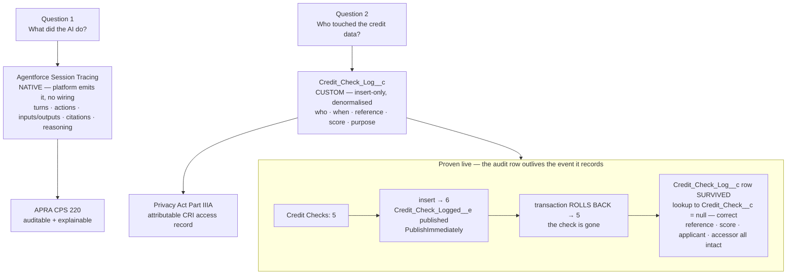
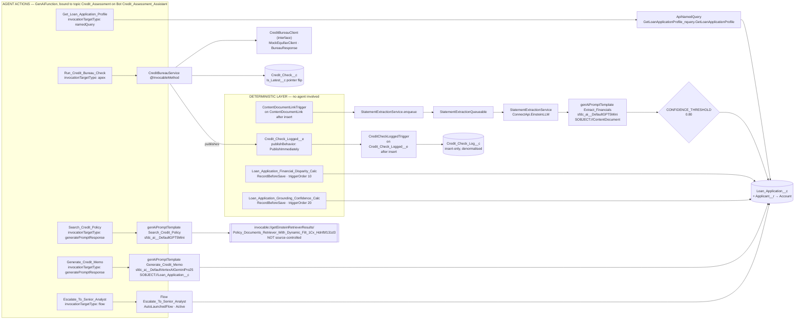
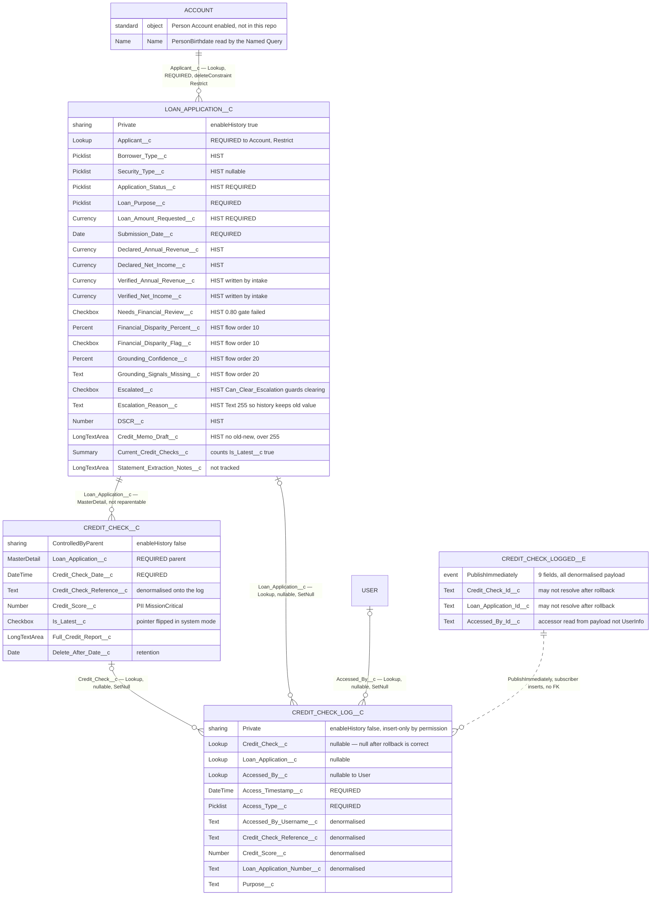

# PrimeCapital Credit Assessment Assistant — Master Design & Presentation Doc

> **Single source of truth** for the FDE panel. Feeds: the deck, rehearsal, and Claude Code (for diagrams + build cross-ref).
> **Case:** Agentforce Employee Agent helping PrimeCapital credit analysts prepare credit memos faster, under **APRA CPS 220 · Australian Privacy Act · ASIC RG 209**.
> **Status:** All 7 required actions BUILT + TESTED LIVE. Design ~95%. Deck assembly + rehearsal remaining.
> **Reliability ladder** (how claims are graded): panel > official Salesforce docs > reputable industry > AI-generated.

**How this doc is organised**
- **Part 1** — Presentation narrative (the deck spine + speaking notes). Start here.
- **Part 2** — Decision reference (pros/cons/limits tables). Your "defend the trade-off" layer.
- **Part 3** — Action-by-action build reference (mechanism, gotchas, evidence).
- **Part 4** — Full Q&A arsenal (all ~48 points, themed). Drill before the grilling.
- **Part 5** — Evidence inventory + diagram TODO list for Claude Code.

---
---

# PART 1 — PRESENTATION NARRATIVE

> Speaking notes + the exact panel lines (quoted). Speak the connective tissue; land the quoted lines verbatim.
> `[DIAGRAM: x]` = Claude Code to draw (see Part 5).

## 1 · The Problem & The Outcome

**The problem (PrimeCapital's world)**
- SMB/mid-market ANZ lender · ~$4B book · ~3,000 apps/month
- Credit analysts spend **2–3 days/file** on manual review — slow, inconsistent
- Regulated: APRA CPS 220, Privacy Act, ASIC RG 209

**The outcome I designed for**
- **~30% faster** memo prep + **consistency** across analysts
- NOT automation of the decision — **decision-support**. The analyst decides; the agent assembles evidence.

**The one-sentence thesis (say this early, it frames everything):**
> "The principle throughout: the AI assembles and presents evidence, but every check a lending decision depends on is done by deterministic code — not the model. The AI accelerates; the deterministic controls decide and record; **and the final lending decision is always a human's.**"

---

## 1.5 · Assumptions (state these up front — scoping = credibility)

> Say these early. Naming your assumptions shows you scoped deliberately, not by omission. Each has a *why*.

| # | Assumption | Why it's reasonable |
|---|---|---|
| 1 | **"Confidence" = grounding completeness** (did I retrieve the evidence, are sources present, did extraction populate fields) — NOT deal-quality or a probability of default | The case doesn't define confidence, so I made it explicit. Grounding-completeness keeps the agent out of the credit judgment; deal-quality confidence would breach the no-verdict boundary. *(Ann's steer: make the assumption, explain the why.)* |
| 2 | **Applications vary by loan type** — segment (secured/unsecured × business/consumer) drives which policy applies, what evidence is required, and which regime governs | RG 209 is consumer-specific; a business borrower submits a P&L, a consumer submits PAYG income. Different loan types = different rules + evidence, so the agent pre-filters policy and handles both document shapes. |
| 3 | **The agent never includes a recommendation / verdict** — it assembles + presents evidence; the human decides | APRA/ASIC hold a *person* accountable for the credit decision. Assuming the agent must not recommend keeps accountability with the analyst and is the safe default for a regulated lender. |
| 4 | **Policy documents live in a separate system** (document store / object store), surfaced to Salesforce — not authored as CRM records | Mirrors how banks actually manage policy content. Drives the file-based ingestion + File Path pre-filter design (see §3). |
| 5 | **The disparity threshold (20%) is a configurable policy parameter**, not an engineering constant | The bank's risk team owns thresholds like this. I assumed a placeholder to demonstrate the *mechanism*; the exact number is a business input, not something the engineer sets. *(Expect "why 20%?" — this is the answer.)* |
| 6 | **The agent is internal / analyst-facing only** — no applicant-facing surface | Employee Agent for decision-support. Reinforces the no-verdict + human-accountability boundary; a customer-facing surface would be a different regime entirely. |
| 7 | **The accountant-prepared statement is the "verified" ground truth** vs the applicant's "declared" figures | Accountant-prepared financials are the corroborating source. Not blind trust — extraction is guarded by a confidence gate (≥0.80) + human review, so a misread doesn't silently become "verified." |

> *Framing line:* "The case left some things open — like how to define confidence — so I made explicit assumptions and designed to them. I'd rather state a clear assumption and my reasoning than leave it ambiguous. Here are the four that shaped the build."

---

## 2 · Architecture at a Glance


*The 7 case asks as built: 5 are agent actions; extraction and audit are deterministic layers, not actions. See the reconciliation note at the end of the doc.*

**The shape:**
- **Employee Agent** ("Credit Assessment Assistant") launched from the **Loan Application record page**
- **One subagent** (`Credit Assessment`) holds the assessment actions — because it's **one intent** ("assess this application"), executed as a sequence of actions
- **7 case asks, delivered as 5 agent actions + 2 non-agent mechanisms** — extraction (Ask 3) is an Apex intake pipeline, audit (Ask 7) is a layer (Session Tracing + a custom log). Both are deliberate, not actions.

```
ASK #                DELIVERED BY                                   PATTERN
1 profile      →     Get Loan Application Profile (Named Query)     FETCH (permission-aware)   [agent action]
2 bureau       →     Run Credit Bureau Check (Equifax mock)         FETCH (API) + immutable insert [agent action]
3 extract      →     Extract Financials (Apex intake pipeline)      EXTRACT (not RAG)          [NOT an agent action]
4 policy       →     Search Credit Policy (RAG, dynamic pre-filter) RAG (the showcase)         [agent action]
5 memo         →     Generate Credit Memo (grounded, cited)         GROUNDED GENERATION (no verdict) [agent action]
6 escalate     →     Escalate To Senior Analyst (+ confidence calc) DETERMINISTIC ROUTING      [agent action]
7 audit        →     Session Tracing + Credit_Check_Log             LAYERED AUDIT              [NOT an agent action]
+ control      →     Financial Disparity Calc (Flow, stored field)  DETERMINISTIC CONTROL      [Flow]
```
> *Panel line:* "Seven asks, five of them agent actions. Extraction is an intake pipeline and audit is a layer — deliberately not actions, because neither should be something the agent chooses to invoke: extraction runs on upload, audit runs automatically. (There's also a 6th action, AnswerQuestionsWithKnowledge, on a separate General FAQ topic — a general-knowledge path outside the credit flow.)"

**Why one subagent, not four** (architecture-restraint point — panel likes this):
- Subagents map to **intents/jobs**, not steps. The analyst has one intent; retrieval + drafting are steps within it.
- Splitting into 4 subagents → the Agent Router has to disambiguate intents that all fire for the same request → fragile.
> *Line:* "Subagents map to intents, not steps. I'd add a second subagent only for a genuinely different job — policy Q&A without an application, say — not for each action in one workflow."

**Org reality (say it proactively — it's a gift):**
> "I attempted the FSC managed package; it failed on Insurance/Wealth dependencies a lending case doesn't need. So I modelled the domain directly — Person Accounts + a custom Loan Application object — which maps cleanly to FSC's objects in production. The build shows I can work within a real org's constraints."

---

## 3 · Grounding — The RAG Showcase (Ask #3, Action 4)


*S3 → UDLO/UDMO → Docling parse → section-aware chunks → hybrid index → the three-retriever ladder → agent.*

**What I built:** the credit-policy corpus as a full RAG pipeline, grounded, cited, pre-filtered by segment.

**The decisions that matter (each is a "why", not just a "what"):**

| Stage | Choice | Why (the one-liner) |
|---|---|---|
| Search type | **Hybrid** | policies have exact terms (DSCR 1.25x, $ thresholds) pure vector misses |
| Parser | **Docling** | preserves table structure — in approval-authority tables the rule *is* the row (dollar band ↔ approver); verified the table retrieved intact in the Playground |
| Chunking | **Section-aware** | headers = boundaries → each chunk = one coherent policy section → **section-level citations** |
| Embedding | **E5 Large V2** | English corpus; matches chunk size (~512 tok) |
| Pre-filter | **File Path** (dynamic) | segment lives in the filename; **the field follows the ingestion source** |
| Ranking | defaults | tune after baseline, not before |

**The headline grounding points:**

**⓪ Docling parser — tables are rules, so structure must survive** (defensible via evidence)
> "My policies have approval-authority tables — a dollar band maps to an approver, and that pairing *is* the lending rule. A parser that flattens tables scrambles which limit maps to which authority, so the model can't tell who approves a $3M facility. Docling preserves table structure — I verified it by retrieving the intact 'Exposure Band | Approval Authority' chunk in the Playground."
> *(Defend on what you PROVED — the intact table retrieved. Do NOT claim you A/B-tested Docling vs another parser; you didn't.)*

**① Pre-filter follows the ingestion source** (verified, strong — deliberate architecture choice)
> "I ingested policies as files from S3 on purpose — it mirrors how banks actually store policy documents: in a document repository or object store, not authored inside the CRM. With file ingestion, the UDMO exposes file metadata — path, type, size — not document content. The segment lives *inside* the PDF, so File Path is the structured field that carries it. The pre-filter field follows the source: file-based → path filtering; record-based → field filtering."

**The deliberate-design framing (say this — it's confident, not defensive):**
> "This was a design choice to reflect a real bank's document architecture. Most institutions keep their credit policies in a managed document store — SharePoint, an object store, a policy library — and surface them to systems, rather than re-authoring every policy as a CRM record. So file-based ingestion is the realistic pattern. That's *why* the pre-filter keys on File Path — it's matching the retrieval design to how the source data actually lives."

**S3 file ingestion vs Salesforce Knowledge — the trade-off (be ready to compare):**

| | **S3 file ingestion** (what I built) | **Knowledge articles** (the CRM-native alt) |
|---|---|---|
| Mirrors bank reality | ✅ policies live in a doc store, surfaced to systems | ⚠️ requires re-authoring policies as CRM records |
| Segment as a field | ❌ lives in filename/content → File Path filter | ✅ `applies_to` is a real record field → direct filter |
| Authoring / ownership | policy team owns the docs in their repository | must be authored + versioned inside Salesforce |
| Maintenance | segment encoded in filename convention | someone maintains the segment field per article |
| Best when | large existing policy corpus in a doc store | policies are few, CRM-managed, frequently edited |

> "If the client wanted `applies_to` as a first-class segment field, I'd support it — but it's a data-architecture decision, not just a config change. It means moving off file-drop ingestion: policies as Knowledge articles with a segment field, a custom DMO with a segment column, or an enrichment step that extracts the segment from the PDF during ingestion and writes it to a structured field. Each makes the segment real and filterable — the trade-off is that someone has to *populate and maintain* it. File Path filtering avoids that because the segment's already in the filename. It's governance-and-maintenance vs simplicity, and it depends on where the bank wants to own its policy content."

**② The dynamic filter is set by data, not hardcoded**
> "The pre-filter isn't static — the agent builds the segment prefix (`PrimeCapital_Policy_Secured_Business%`) at runtime from the security + borrower type that Action 1 already fetched. Right policy for the right loan, decided by data. Verified live: from Maria's Secured+Business profile it built the correct prefix, casing and trailing `%` included."

**③ Section-aware chunking → section-precise citations** (grounding choice paying off downstream)
> "Section-aware chunking isn't only retrieval quality — it makes citations section-precise. 'Per the Serviceability Assessment section, Clause 4.2' is more useful to an analyst than 'page 4.'"

**Proven live:** query "DSCR for secured business" → chunks all from `Secured_Business.pdf` (no cross-segment leak) → cited summary (DSCR 1.25x, ICR 2.0x, Clause 4.2). **Source Recall metric = 0.67** on the static-filter test (RAG-accuracy evidence; the 0.67 is *explainable* — see Part 4).

**The three-retriever ladder** (demo arc — one slide each):
```
Without Filter → unsecured chunk LEAKS in (the problem)
Static Filter  → wrong segment EXCLUDED (proof it works) + Source Recall metric
Dynamic Filter → variable-driven (the production design — what the agent uses)
```
- **Why static isn't the production answer:** static hardcodes ONE segment → you'd need 4 retrievers (one per segment) + logic to pick between them. Dynamic uses a variable the agent fills at runtime from the applicant's own segment → **one retriever serves all four.** Static = the *proof*; dynamic = *production* (you can't hardcode the filter for a real applicant pool).
- **Source Recall (0–1, higher = better):** = (relevant docs retrieved) / (relevant docs expected). 0.67 = found 2 of 3 marked-relevant docs. **Not a retriever failure** — my demo filter deliberately excluded the universal policy the test set also marks relevant, so the metric is *correctly detecting my own filtering trade-off*. Production OR-logic → 1.0. (Recall ≠ precision; I lead with recall because it's the panel's ask + native to the Playground.)

---

## 4 · Guardrails & Governance — "LLM surfaces, controls decide"


*The LLM is the soft centre. Every ring around it is code that runs the same way every time — and the outermost ring is a person.*

**This is the heart of the presentation.** Every credit-critical judgment is deterministic code, not model opinion.

**Where the numbers the controls read come from — intake, not assessment:**


*Extraction happens once at upload and writes stored fields; the controls fire on that save. At assessment the agent grounds on trusted fields, not on a re-read of the document.*

**The controls (all deterministic, all built):**

**① Financial Disparity Calc** — stored field, not formula
- `(Declared − Verified) / Verified × 100`, signed; flag TRUE at ≥20%.
- **The Flow does the arithmetic and writes the result to a stored field** — it is NOT a formula *field* (a field type that recalcs on every read).
- **Null/zero guard = a Decision element in the Flow:** checks **both Declared and Verified for null and zero** (four conditions) *before* dividing. If any are unsafe → abstains (null %, no flag, no error) rather than throwing a divide error or fabricating a "clean." *(Post-TODO-C — the guard was widened from Verified-only to cover declared-zero too.)*
> "The disparity flag is a stored field written by a Flow — not a formula *field*. A formula field recalcs on every read: edit the revenue later and the flag silently changes, and you've lost what it was at assessment time. My Flow computes it once and stores it, frozen. And the Flow guards the division — it checks the verified figure isn't null or zero before dividing, and abstains if it can't safely compute rather than erroring or inventing a pass."
> **⚠️ TO VERIFY:** "stored = frozen" is true just by being a stored field. But "auditable" (provable change history) needs **Field History Tracking enabled** on the disparity fields. Confirm it's ON → then the "auditable" claim is fully backed (frozen value + tracked who/when/what). If OFF → soften to "frozen at assessment time" and name Field History / Field Audit Trail as the productionisation step for full audit history.

**② Grounding Confidence — "do I have complete evidence?", not "is this a good loan?"**
- A **Flow** checks the evidence on the record and resolves to one of three bands by **strict precedence — the hardest failure wins, it's NOT a tally:**
  ```
  ANY "evidence missing" condition  → LOW (20)      (e.g. no bureau result, financials not extracted)
  else ANY "profile incomplete"     → MEDIUM (50)   (required profile fields not all present)
  else                              → HIGH (100)
  ```
- The signals check **field presence on the record** — e.g. is `Applicant__c`, `Security_Type__c`, `Declared_Annual_Revenue__c` populated, is there a current credit check, are the verified financials filled, did extraction flag `Needs_Financial_Review__c`. *(It tests the data is there — not whether a given action "ran".)*
- It's **not the AI grading its own work** (circular), and **not a judgment about the loan** (would breach no-verdict) — only about whether the evidence is all present.
> "Confidence asks one thing: do I have complete, trustworthy evidence? It's two tiers, and the hardest failure wins — any missing evidence drops it to Low, otherwise an incomplete profile is Medium, otherwise High. Not a tally, and computed by a Flow off the record's fields — not the model grading itself, and deliberately not a view on whether it's a good loan. The moment confidence means 'this looks like a weak deal,' the agent has crossed into the lending decision — which it must never make."

**③ The no-verdict boundary — repeated in 4 places, and it held when things broke**
- The "never state a verdict" rule is written at **four levels** — planner (agent-level) instructions, the Credit Assessment topic description, the `Generate_Credit_Memo` template, and the `Search_Credit_Policy` template — so no single edit can quietly remove it. (Defence-in-depth for the *instruction*, not just the data.)
- **It held under failure:** in testing, when actions misrouted or data was missing, the agent never invented a figure or a decision — it admitted the gap and escalated.
> "The accountability boundary is the one rule I over-specify — stated at four levels so a reword can't erode it. And it held when the system failed: misroutes and thin data never produced a fake verdict. It admitted the gap and escalated — the boundary working when it matters most."
> *(The "~5×" is observed testing behaviour across failure cases — misroutes, empty policy searches, thin data — not a measured benchmark. Say it as "every failure case I hit," not a statistic.)*

**④ You can't build a control on the AI "noticing"** (panel-gold — the thesis, concretely)
- In one test, the agent *happened* to spot the 25% income overstatement on its own. Nice — but I don't rely on that.
- The disparity flag is a **deterministic calc that fires every time** — not only when the model happens to catch it.
> "The model caught the overstatement here on its own — but a credit control can't depend on the AI noticing. Some days it will, some days it won't. That's why the disparity check is deterministic code that fires every single time. The AI surfaces; the control catches."

**Defence in depth — two checks asking different questions**
```
Confidence → is the evidence COMPLETE?   (did all the data arrive?)
Disparity  → is the evidence CONSISTENT? (do declared & verified agree?)
→ escalate if EITHER trips
```
- A case can be **complete but inconsistent** — LA-0003: all evidence present, but declared vs verified revenue differ 25% → disparity catches it, confidence wouldn't.
- So "high confidence + an escalation" isn't a contradiction — the two controls measure different things, and each catches what the other misses.
> "High confidence and an escalation aren't a contradiction. Confidence asks if the evidence is complete; disparity asks if it's consistent. A case can be fully evidenced but have declared and verified revenue disagreeing by 25% — complete, but inconsistent. One control alone would miss it."


*The two controls are orthogonal by construction: neither reads the other's fields, so neither can mask the other's finding.*

---

## 5 · Human-in-the-Loop & Audit (Asks #6, #7)


*A hand-off with accountability: the record moves to a senior, the reason is written, and the junior who raised it cannot close it.*

**Escalation = a hand-off with accountability, not just a flag**
- Triggers on **low confidence OR a disparity** (either one alone — a single red flag is enough).
- When it trips, a **Flow** writes exactly three fields — marks the case escalated (`Escalated__c`), writes *why* (`Escalation_Reason__c`), and **reassigns the record** (`OwnerId`) to a senior analyst (Sofia Marchetti). The full evidence trail is **returned to the analyst in-session** (an output variable to the agent), not stored on the record.
- **Separation of duties:** a junior **can't clear their own flagged case** — a custom permission (`Can_Clear_Escalation`, senior-only) plus a validation rule enforce it. A senior must review.
> "Escalation isn't just a flag — it's a hand-off with accountability. When a control trips, the reason is written to the record and ownership reassigns to a senior, and the full evidence trail is handed back to the analyst in-session. A junior can't self-clear a flagged case — that's separation of duties enforced by the platform, not convention. It's OR, not AND: any single red flag escalates. At scale I'd route to a senior queue rather than a named person."

**Both triggers proven live:**
```
LA-0003 → disparity (25% gap)     → reassigned to Sofia + evidence trail ✅
LA-0007 → low confidence (thin)   → reassigned to Sofia, names what's missing ✅
```

### Two audits, because there are two different questions


*Two questions, two mechanisms. The native trace answers what the AI did; the custom log answers who touched credit data — and it survives the transaction it audits.*

| Question | Mechanism | Notes |
|---|---|---|
| **"What did the AI do?"** | Agentforce **Session Tracing** (native) | every action, input/output, citation, reasoning, per session — Ask #7. **Platform emits it — no wiring.** |
| **"Who touched the credit data?"** | custom **`Credit_Check_Log__c`** | Part IIIA / Privacy Act. Insert-only, survives deletion. |

> "I don't hand-roll the AI-interaction log — Session Tracing emits it natively. My Credit Check Log is a different layer: the credit-data access record for Part IIIA, with legal properties a platform trace doesn't guarantee — insert-only, defined retention, survives deletion. Two questions, two mechanisms."

### The headline: the audit row survives even when the thing it records is deleted

The hard part of an audit log: it has to outlive the event it records. I proved it live.

```
Credit Checks:  5 → 6 → 5   ← inserted a check, transaction rolled back, it's gone
Audit row:      SURVIVED     ← reference, score, loan app, accessor — all still there
Lookup to check: null        ← correct: it points at a check that no longer exists
```

**Two tricks make this work:**
1. **Publish-immediately Platform Event** → the audit row is written *outside* the transaction, so a rollback can't take it with it.
2. **Denormalise the detail onto the log** → the row carries its own copy of the reference/score/etc., so it still *means* something even after the check it pointed to is gone.

> "The operation was undone; the record that it *happened* cannot be. A publish-immediately Platform Event makes the audit survive the rollback, and denormalising the detail onto it means the row is still self-describing after the thing it references is gone."

---

## 6 · Proof — How I Tested

**I tested each layer for what that layer is supposed to do** (not one blanket "it works"):

| Layer | How I tested it | Result |
|---|---|---|
| **Retrieval** | Retriever Playground, before/after the pre-filter | wrong-segment excluded; **Source Recall 0.67** (explainable) |
| **Extraction** | fed a statement with decoy line items | picked Sales Revenue over Total Income, Net Profit over EBIT; confidence 0.95 |
| **Generation** | ran the memo from the record page | exact figures, every policy point cited, no verdict |
| **End-to-end** | full chain across seeded scenarios | profile → bureau → policy → memo → escalation, live |
| **Deterministic controls** | Apex tests asserting stored fields after DML | **57/57 passing** |

**On measuring RAG accuracy:** I'd reference **RAGAS** (context precision/recall, faithfulness, answer relevance) as the standard framework — *flagged as not-confirmed-Salesforce terminology.* The native **Source Recall** metric pairs with it, and I have a real number (0.67) I can explain.

**The seeded scenarios — each proves a different path:**
```
LA-0001 Maria Chen    Business/Secured    disparity 33% → flag + memo flags it
LA-0003 Priya Raman   Business/Unsecured  disparity 25% → escalates (consistency)
LA-0004 Tom Whitfield Consumer/Unsecured  disparity abstains (declared absent) → Medium confidence → does NOT escalate
LA-0007 Nathan Cole   thin/incomplete     low confidence → escalates (all layers agree "insufficient")
```

---

## 7 · Risks & Productionisation (the honest close)

**The risks that matter for AI in lending aren't mostly technical — they're about how the AI changes human behaviour, and where it could cause harm.** Two tiers.

### Tier 1 — The AI / business risks (what a CRO actually worries about)

| Risk | Why it matters | My mitigation | Residual |
|---|---|---|---|
| **Automation bias** ⭐ | analyst over-trusts a fluent memo and stops their own checks — the *human* is the risk surface, not the code | no verdict = nothing to rubber-stamp; every claim cited = verify in one click; deterministic controls catch what the model misses | training + UX must keep the analyst active, not passive |
| **Hallucination → bad advice** | agent invents a policy provision or figure → analyst relies on it | grounding + citations (every claim traces to a source); figures are record-typed, not model-typed | a confident, fluent output can still mislead if unverified |
| **Wrong / stale policy retrieved** | policy changes but the index isn't rebuilt → agent cites outdated rules | pre-filter + section-aware citations show *which* policy version | **policy freshness** — someone must own re-indexing on policy change |
| **Extraction error on financials** | OCR reads $90k as $900k → disparity + memo built on a wrong number | confidence gate (≥0.80) + human-review flag | a *confident-wrong* extraction can slip the gate |
| **Bias / fairness** ⭐ | an AI in lending could systematically disadvantage a group (APRA/ASIC + consumer-fairness concern) | **the AI is kept OUT of credit scoring entirely** — it surfaces evidence, never rates the applicant → structurally limits discriminatory-scoring risk | evidence-surfacing could still bias *what the analyst sees first* |
| **Data privacy / PII** | unmasked PII reaches the LLM; CRI exposure | Trust Layer zero-retention + permission-aware + FLS + insert-only audit | masking-disabled posture (platform behaviour, documented) |
| **Model / vendor drift** | a foundation-model update changes behaviour; provider deprecates a model | model tiering + Trust Layer abstracts providers | needs model-risk-management sign-off + eval monitoring |
| **Operational failure** | Equifax API down, retrieval times out mid-assessment | graceful degradation — agent admits gaps rather than fabricating; falls back to manual | availability SLAs to define |

> *Framing line:* "The biggest risk isn't the AI being wrong — it's the analyst over-trusting a fluent memo and stopping their own checks. That's automation bias, and my whole design fights it: the AI never gives a verdict, so there's nothing to rubber-stamp; every claim is cited, so verification is one click. And on fairness — I deliberately kept the AI out of credit scoring, so it can't encode discriminatory scoring. It surfaces evidence; it doesn't rate applicants."

### Tier 2 — Implementation limits (honest engineering caveats)

| Limit | The honest position |
|---|---|
| **Insert-only isn't tamper-proof** | permission-layer control; system-mode Apex / `Modify All Data` can still update. True immutability = validation rule / Field Audit Trail. |
| **Disparity abstains on declared-zero** | known residual — the confidence layer catches it; full fix teaches completeness that "zero = missing." |
| **Named Query API is Beta (v67)** | used knowingly, with an Apex `@InvocableMethod` drop-in fallback. |
| **File-notification pipeline** | reference installer (broad IAM, no IaC) — prod wants Terraform + tightened roles. |
| **Agentforce CI/CD deployment** ⭐ | an agent is a *web* of interdependent metadata — planner → topics → actions → prompt templates, plus Apex, Flows, and the Data Cloud retriever layer (which promotes on a *separate* path). Risks: dependency ordering; some settings are **UI-only toggles** a pipeline can't reproduce; AI-generated Apex needs same-or-stricter review; standard test gates cover Apex but **not the agent's reasoning** (a deploy can pass every unit test and still misroute). Managed via ordered deploys + agent-behaviour evals in the gate + stricter AI-code review. **Built in a single dev org — a sandbox→prod pipeline with those gates is a production step, not something I stood up.** |

### What I'd do to productionise
- Real Equifax endpoint — interface seam already there, one-line swap
- Data minimisation in the profile SOQL (Privacy Act collection-minimisation)
- Dedicated `applies_to` field *if* policies move to record-based storage (see §3 trade-off)
- Route to a senior **queue**, not a named user, for scale
- Automated **eval pipeline** (metric-based monitoring of retrieval + extraction quality) — **not** a second agent (deliberate restraint)
- **Policy re-indexing ownership** — a process to rebuild the index when policies change (addresses the freshness risk)
- Model-risk-management sign-off on the foundation models

> *Closing line:* "Every credit-critical decision in this system is deterministic and auditable. The AI accelerates the analyst — it never replaces their judgment, and it never makes a call it can't show its working for. That's what a regulated lender needs from AI."

---

## 8 · Compliance — Proving It, Not Just Claiming It (dedicated slide)

```mermaid
%% CROSS-CHECK: every control named below resolves to a real deployed component.
%%  Credit_Analyst PSG = Loan_Application_Base + Loan_Application_Sensitive_Financials
%%    + Credit_Check (3 components — matches the doc).
%%  Credit_Check__c.Credit_Score__c carries complianceGroup PII +
%%    securityClassification MissionCritical.
%%  GetLoanApplicationProfile selects 9 fields including Applicant__r.PersonBirthdate
%%    — the minimisation point is real and demonstrable.
flowchart TB
  subgraph APRA["APRA CPS 220 — Risk Management"]
    direction LR
    AR1["Controls are auditable"] --> AC1["Session Tracing + Credit_Check_Log__c"] --> AE1["execution trace · Credit Check Log tab"]
    AR2["Decisions are explainable"] --> AC2["trace: topic → action → reasoning<br/>+ cited memo"] --> AE2["memo shot + trace"]
    AR3["A person is accountable"] --> AC3["no-verdict boundary at 4 instruction levels"] --> AE3["planner instructions · memo with no approve/decline"]
    AR4["Controls work as designed"] --> AC4["before-save flows, triggerOrder 10 / 20"] --> AE4["57/57 Apex tests · seeded scenario results"]
  end

  subgraph PRIV["Privacy Act — APPs + Part IIIA"]
    direction LR
    PR1["Collect only what is needed — APP 3"] --> PC1["GetLoanApplicationProfile SOQL is scoped"] --> PE1["address fetched but not shown in chat"]
    PR2["Record who accessed credit data — Part IIIA"] --> PC2["Credit_Check_Log__c, insert-only, denormalised"] --> PE2["log rows · rollback-survival 5→6→5"]
    PR3["Keep PII secure — APP 11"] --> PC3["Credit_Analyst PSG — FLS + permission-aware<br/>Credit_Score__c = PII / MissionCritical"] --> PE3["PSG config · data classification panel"]
    PR4["Attribute access to a person"] --> PC4["invocable runs in the analyst session"] --> PE4["Created By = analyst on the Credit Check"]
  end

  subgraph RG209["ASIC RG 209 — Responsible Lending (consumer)"]
    direction LR
    RR1["Verify, do not assume"] --> RC1["deterministic disparity calc — and it abstains<br/>rather than asserting clean"] --> RE1["flag true on LA-0001 / LA-0003<br/>null on LA-0004"]
    RR2["Applies to consumer credit"] --> RC2["Borrower_Type__c drives regime + evidence shape"] --> RE2["Tom Whitfield PAYG vs business P&L"]
    RR3["Make reasonable inquiries"] --> RC3["bureau + financials + policy gathered before any memo"] --> RE3["action chain · escalation evidence trail"]
  end
```


*Compliance is a traceability problem. Every row is requirement → control → evidence, and every control is a component that exists in the org.*

**Say this first (the honest, senior positioning):**
> "I'm not claiming this is *certified* compliant — that's Risk and Legal's call. What I can show is that every requirement I can map has a specific control behind it, and every control leaves evidence an auditor could inspect. Compliance is a traceability problem — requirement → control → evidence — and here's the map."

**The mental model:**
```
THE RULE  →  WHAT IT ASKS FOR  →  WHAT I BUILT  →  WHAT PROVES IT
```

### APRA CPS 220 — Risk Management

| What it asks for | My control | What proves it |
|---|---|---|
| Controls are **auditable** | Session Tracing + Credit_Check_Log | execution trace; Credit Check Log tab |
| Decisions are **explainable** | trace shows subagent→action→reasoning; cited memo | memo shot + trace |
| A **person is accountable** | no-verdict boundary; analyst decides | agent instructions + memo (no approve/decline) |
| Controls **work as designed** | 57/57 Apex tests; deterministic Flows | test run + scenario results |

### Privacy Act — APPs + Part IIIA (credit reporting)

| What it asks for | My control | What proves it |
|---|---|---|
| Collect only what's needed (APP 3) | profile SOQL scoped | "address fetched but not shown" |
| Record who accessed credit data (Part IIIA) | Credit_Check_Log — who/when, insert-only | log rows; rollback-survival |
| Keep PII secure (APP 11) | FLS + permission-aware + zero-retention | PSG config; masking posture |
| Attribute access to a person | invocable runs as the analyst | Created By = analyst on the check |

### ASIC RG 209 — Responsible Lending (consumer)

| What it asks for | My control | What proves it |
|---|---|---|
| **Verify, don't assume** | deterministic disparity calc | disparity flag on LA-0001 / LA-0003 |
| Applies to **consumer** credit | Borrower_Type drives regime + evidence | Tom Whitfield (PAYG) vs business (P&L) |
| Make **reasonable inquiries** | bureau + financials + policy before memo | the action chain; evidence trail |

### Be precise about what's proven vs designed (this is the credibility move)

```
PROVEN LIVE     → rollback-survival · disparity flag · no-verdict held ·
                  Created By = analyst · 57/57 tests
DESIGNED, SOUND → Session Tracing as the APRA log (native platform, not my custom build) ·
                  data minimisation (noted as a prod step)
PRODUCTION STEP → Field Audit Trail for true immutability · Terraform IAM ·
                  model-risk sign-off · confirm Session Tracing retention
```
> "I'm precise about what's proven versus designed versus a production step. Rollback-survival, the disparity flag, the no-verdict boundary — proven live. Session Tracing as the audit log — native platform behaviour I rely on, not something I hand-built. Field Audit Trail for true tamper-proofing — a production step. Claiming 'proven' for something only designed is exactly the trap I avoid."

### Gaps I name before they ask
- **Insert-only isn't tamper-proof** — Modify All Data / system-mode bypass. True immutability = Field Audit Trail.
- **Session Tracing retention** — I'd confirm the native trace is kept for APRA's record-keeping period; if not, mirror critical events to a governed store.
- **I map controls; Risk certifies** — the mapping is mine; a compliance officer validates it. I don't overstate my lane.

---
---

---
---

# PART 2 — DECISION REFERENCE (pros / cons / limits)

> Your "defend the trade-off" layer. Every major decision: why, what it buys, what it costs.

## Grounding / RAG decisions

| Decision | Why | Pros | Cons / Limits |
|---|---|---|---|
| **Hybrid search** (vs vector-only) | policies have exact terms vector misses | catches DSCR 1.25x, $ thresholds, clause refs | slightly more index config |
| **Docling parser** (vs default/LLM) | tables carry lending rules — row pairing must survive | table structure preserved; verified intact table retrieved in Playground; cheap/fast | claim is "table survived" (proven), NOT "beat another parser" (not A/B tested); LLM parser only needed for images (none here) |
| **Section-aware chunking** | headers = natural boundaries | coherent chunks; section-level citations | very large sections could exceed embed window (not hit) |
| **File Path pre-filter** (vs dedicated `applies_to`) | mirrors real bank doc storage (policies live in a doc store, not the CRM); file ingestion exposes only file metadata | realistic pattern; no CRM re-authoring; segment in filename; works, proven | segment is a path convention not a record field; a Knowledge/DMO source gives a real `applies_to` but needs the field populated + maintained (= different architecture) |
| **Dynamic filter** (vs static) | applicants span 4 segments | one retriever serves all; data-driven | agent must build the prefix string (verified correct) |
| **Individual retriever** (vs ensemble) | one policy corpus | no orchestration overhead | ensemble only if a 2nd corpus (benchmarks) added |

## Deterministic controls

| Decision | Why | Pros | Cons / Limits |
|---|---|---|---|
| **Disparity = stored field written by Flow** (vs formula *field*) | point-in-time integrity | frozen evidence; survives later edits; Flow can guard null/zero + abstain | needs a Flow (vs a formula field's zero-build); "auditable" needs Field History enabled (see note) |
| **Grounding confidence = completeness** (vs LLM self-score / retriever score) | escalation can't depend on model opinion | deterministic, auditable, protects no-verdict | doesn't measure policy *relevance* (only presence) |
| **Confidence: 4 observable signals** | objective, no deal-judgment | can't drift into lending opinion | "declared 0 = complete" residual (2 layers disagree on zero) |
| **`triggerOrder` pinned** (disparity 10, confidence 20) | determinism by construction | no latent ordering bug if flows later share fields | does nothing *today* (disjoint field sets) — deliberate |

## Agent / action architecture

| Decision | Why | Pros | Cons / Limits |
|---|---|---|---|
| **Employee Agent** (vs Service) | serves the analyst, not customers | correct regime; analyst accountable | — |
| **One subagent** (vs per-action) | one intent = one subagent | clean routing; no misroute between steps | classification must cover standalone policy Qs (fixed after a live misroute) |
| **Named Query** (vs Flow Get Records) | profile spans Person Account + Loan App | one permission-aware relationship query | **Beta (v67)** — Apex invocable is the fallback |
| **@InvocableMethod** (vs Apex REST) for bureau | one consumer (this agent) | native access, no OpenAPI overhead, runs as analyst, Platform Event in-transaction | not externally reusable (would use Apex REST if a portal needed it) |
| **Extract = intake step** (vs live assessment action) | disparity Flow reads STORED fields | point-in-time; clean separation; agent grounds on trusted fields | ~20-25s async latency on upload |
| **Trigger on ContentDocumentLink** (vs ContentVersion) | link is the event that matters | catches link-after-upload + multi-link | Apex-only (Flow can't trigger on CDL) |
| **Record-typed memo input** (vs LLM re-serialising figures) | exact deterministic financials | 1,200,000 stays exact, never "~1.2M" | needs record hydrated with Id (was the point-37 bug, fixed by re-rooting) |

## Audit / compliance

| Decision | Why | Pros | Cons / Limits |
|---|---|---|---|
| **Layered audit** (Session Tracing + custom log) | different legal properties | native AI-audit + governed Part IIIA record | custom log needs retention governance built |
| **Platform Event (publish-immediately)** for audit | row must survive rollback | audit survives the transaction it audits | more moving parts than a plain insert |
| **Denormalise detail onto log** | row must still *mean* something after rollback | self-contained audit; null lookup is correct | data duplication (deliberate) |
| **Masking disabled for agents** (accepted, not chosen) | platform behaviour, not a toggle | forces the right protections (zero-retention + FLS + permission-aware) | PII reaches LLM unmasked (defensible, not ideal) |
| **Separation of duties** (custom perm + validation rule) | junior can't self-clear | enforced by platform | senior username in a Flow constant (update if user recreated) |

---
---

# PART 3 — ACTION-BY-ACTION BUILD REFERENCE

> Mechanism · status · key gotchas · evidence. For Claude Code cross-ref + your build recall.

## 3.0 · Action-to-implementation map

Every capability and what actually powers it. Names below are the deployed API names, verified against `force-app/main/default` — use these verbatim if a panelist asks "what is that built on?"



## 3.0b · Object / data model

Relationship types are the design, not incidental: Credit Check is **master-detail**, so immutability inherits sharing from the application, while every Credit Check Log lookup is a **nullable `SetNull`** — which is precisely what lets the audit row survive the rollback of the thing it records.



**Three things the metadata contradicts — worth knowing before you're asked:**

- **`Applicant__c` is `required = true`, so one confidence condition is dead code.** The `Profile_Incomplete` rule in `Loan_Application_Grounding_Confidence_Calc` tests `$Record.Applicant__c IsNull`, but the field is required with `deleteConstraint: Restrict` — it can never be null on a saved record. `Security_Type__c` and `Declared_Annual_Revenue__c` are nullable, so the rule still works; the applicant check is simply inert. If asked "what if the applicant is missing?", the honest answer is that the field won't let you save it, not that confidence catches it.
- **There are no custom record types in this build.** Person Accounts uses the *standard* `PersonAccount` record type on `Account`, resolved at runtime by `CreditEscalationTest` via `getRecordTypeInfosByDeveloperName()`.
- **`Can_Clear_Escalation` attaches to no object.** It is a `CustomPermission` referenced only by the `Only_Senior_Can_Clear_Escalation` validation-rule formula and granted solely by the `Senior_Credit_Analyst` permission set, so it has no place in the ERD as a relationship.

Two smaller ones: `Credit_Memo_Draft__c` is history-tracked but is a Long Text Area, so it records "edited" with no old/new — the same limitation that forced `Escalation_Reason__c` to Text(255), still live on that field. And `Credit_Check__c.Delete_After_Date__c` is a retention field that nothing in the codebase reads: declared intent with no enforcement behind it.

## Action 1 — Get Loan Application Profile *(LIVE)*
- **Mechanism:** Named Query API (Beta, v67) → API Catalog → agent action → Credit Assessment subagent.
- **Re-rooting fix (point 37→resolved):** originally Account-rooted → returned no Loan App Id → memo couldn't hydrate. Re-rooted on `Loan_Application__c` (returns its Id top-level, applicant via `Applicant__r`). Agent launches from the loan app record page (`currentRecordId`).
- **Gotchas:** activation LOCKS the query (deactivate to edit); verify field API names first (`Loan_Amount_Requested__c` not `Loan_Amount__c`); API name no underscores; output nests inside `200` object.
- **Evidence:** execution trace (Input→subagent→reasoning→action), Maria Chen fields returned.

## Action 2 — Run Credit Bureau Check (Equifax mock) *(PROVEN LIVE)*
- **Mechanism:** `CreditBureauClient` interface ← `MockEquifaxClient` → immutable `Credit_Check__c` (Is_Latest flip, system-mode) → publish-immediately Platform Event `Credit_Check_Logged__e` → subscriber inserts self-contained `Credit_Check_Log__c`.
- **Wired as `@InvocableMethod`** agent action. Permission-aware proof: new check's Created By = invoking analyst.
- **Rollback survival PROVEN:** 5→6→5, check gone, audit row survived (denormalised), lookup null (correct).
- **Gotchas:** subscriber null-checks before linking (else `INVALID_CROSS_REFERENCE_KEY` destroys the audit); Apex class access via PSG (or agent silently can't call it); real Equifax swaps in at one line.
- **Demo:** normal path = CC-0005 on LA-0001 via related list; rollback = CCL-0001 via Credit Check Log **tab** (related list won't show it — null parent).

## Action 3 — Extract Financials *(LIVE)*
- **Mechanism:** Prompt Builder File Input (multi-modal Flex, PDF, GPT 5 Mini) + Apex intake pipeline: trigger on ContentDocumentLink → Queueable (async) → `@InvocableMethod` calls template → strip fences → JSON parse → confidence gate (≥0.80) → write `Verified_*` / flag `Needs_Financial_Review__c`.
- **Intake, not assessment:** extract once on upload → write stored fields → disparity calc auto-fires. Agent reads stored fields at assessment time, not the PDF.
- **Accuracy proof:** picked Sales Revenue over Total Income, Net Profit over EBIT; source_notes prove reasoning; conf 0.95.
- **Gotchas:** File input = Object type search "File" (polymorphic workaround); template can't write fields (Apex does); ~20-25s latency (refresh after); `a05` exact prefix (Credit_Check is `a06`); existing attachments don't reprocess (re-upload).

## Action 4 — Search Credit Policy (RAG) *(LIVE + routing fix)*
- **Mechanism:** Dynamic Filter retriever → Flex prompt template (grounds + cites) → agent action → subagent.
- **Two inputs:** Search Text (`varQuery`) + File_Path pre-filter (`varLoanSegment`, prefix + `%`).
- **Routing miss→fix (point 30):** memo-framed classification let standalone policy Qs leak to General FAQ → broadened classification, named DSCR/ICR keywords, routing directive. Both traces = deck before/after.
- **Gotchas:** save+activate before preview; transient "data provider invalid" post-activate (retry); `Like` needs `%` in agent context (not in Playground); only Chunk + File Path output fields.

## Action 5 — Generate Credit Memo *(FULL CHAIN LIVE)*
- **Mechanism:** Flex prompt template. Inputs: `varLoanApp` (record → merge fields, exact figures) + `varPolicy` (Free Text, cited prose from Action 4). Model: **Gemini 2.5 Pro**.
- **Chain live from record page:** Maria Chen, 750k, declared 1.2M / verified 900k, discrepancy flagged, policy cited, no verdict.
- **No-verdict stated 3×.** Masking preview-artifact resolved (preview masks, agent won't — point 35).
- **Gotchas:** merge fields via resource picker (not typed); record needs Id to hydrate (point 37 fix); save+activate.

## Action 6 — Escalation + Grounding Confidence *(PROVEN LIVE)*
- **Confidence calc:** before-save Flow, 4 signals (profile/bureau/financials/review), Roll-Up Summary `Current_Credit_Checks__c` for bureau signal (auto-recalcs via master-detail — no query). Bands Low20/Med50/High100.
- **Escalation Flow:** autolaunched (triggered flow can't be an agent action), sets `Escalated__c`, reassigns owner to Sofia (username in constant), composes evidence trail. Exposed as GenAiFunction.
- **Separation of duties:** `Can_Clear_Escalation` custom perm + `Senior_Credit_Analyst` PS + validation rule (blocks junior true→false clear).
- **Both triggers proven:** LA-0003 (disparity), LA-0007 (low confidence).
- **Senior user:** Sofia Marchetti (also the non-admin insert-only proof user — double duty).

## Action 7 — Audit *(architected)*
- **Layer 1:** Agentforce Session Tracing (native) = the AI-interaction log (Ask #7).
- **Layer 2:** `Credit_Check_Log__c` = credit-data access (Part IIIA).
- **Future hook:** mirror the structured `Citations` output into the log for "what policy grounded this memo."

## Component — Financial Disparity Calc *(LIVE)*
- Before-save Flow, `(Declared−Verified)/Verified×100` signed, flag ≥20%, stored fields, null/zero guard.
- Abstains on missing declared (TODO-C fix) — null percent, no flag, not a fabricated "clean."
- 57/57 Apex tests. Seeds: LA-0001 33.33/true, LA-0003 25/true, LA-0004 null/false.

---
---
# PART 4 — Q&A ARSENAL (drill before the grilling)

> Every point, themed. The **★ headline** ones are in Part 1. The rest are here for when the panel digs.
> Format: the likely question → your answer (with the quotable line).

## Theme A — "How do you stop the AI making the credit decision?"

**★ A1 · No-verdict boundary (repeated 4×, held under failure)**
> "The 'never state a verdict' rule is written at four levels — planner instructions, the topic description, the memo template, and the policy-search template — so no single edit can erode it. And it held when things broke: misroutes and thin data never produced a fake verdict — the agent admitted the gap and escalated. (The '~5×' is observed testing behaviour, not a benchmark — say 'every failure case I hit.')"

**★ A2 · You can't build a control on the AI "noticing"**
> "The model caught the overstatement here on its own — but a credit control can't depend on the AI noticing. Some days it will, some days it won't. That's why the disparity check is deterministic code that fires every single time. The AI surfaces; the control catches."

**A3 · Confidence is completeness, never deal-quality**
> "The moment confidence means 'weak deal,' the agent crossed into lending. It stays on evidence-completeness: did I retrieve it, is it present, did extraction populate it."

**A4 · Memo is evidence ASSEMBLY, not generation from nothing**
> "Every figure traces to the record; every policy point to a citation. Nothing invented — assembling grounded evidence, not writing from thin air."

**A5 · Record-typed input for figures**
> "I don't let the model re-type financials — they come off the record via merge fields, exact. 1,200,000 vs 900,000 stay exact, never rounded to ~1.2M. The disparity story depends on that precision."

**A6 · "Why escalate on OR, not AND?"**
> "It's OR — either low confidence or a disparity escalates on its own. If it were AND, a case with a clear 25% overstatement but otherwise complete evidence wouldn't escalate, because confidence was fine — the overstatement would slip through. A single red flag should be enough to bring in a human. You escalate on *any* problem, not only when everything fails at once. That's also why the two controls work as defence-in-depth — they're independent triggers, each catching what the other misses."

## Theme B — "How is this auditable / compliant?" (APRA, Privacy Act, RG 209)

**★ B1 · Layered audit** (Session Tracing + Credit_Check_Log) — see Part 1 §5.

**★ B2 · Rollback-surviving audit** (Platform Event + denormalisation, proven live) — see Part 1 §5.

**B3 · Subscriber null-checks before linking**
> "Setting the log's lookup to a rolled-back Id throws and would destroy the very row it's protecting. The null link is correct; the denormalised fields carry the meaning."

**B4 · The execution trace IS the explainability artifact**
> "Explainability isn't a document I write after — it's emitted per interaction: which subagent, which action, what went in, what came back. That's the raw material for the APRA trail."

**B5 · Separation of duties** (junior can't self-clear) — see Part 1 §5.

**B6 · Structured `Citations` output** (two citation layers)
> "Grounding gives me two citation layers — human-readable in the response, and a structured Citations object I can capture into the audit trail. Explainability is a typed output, not bolted on."

**B7 · RG 209 scope nuance** (business vs consumer)
> "Responsible lending is consumer-specific. So borrower type isn't just a pre-filter segment — it's a different regime with different evidence. My business applicant submits a P&L; my consumer submits a PAYG income statement. Extraction handles both."

**B8 · Permission-aware execution** (Created By = the analyst)
> "The bureau invocable ran in the analyst's session — the new Credit Check's Created By is the real user, not a system account. CRI access is attributed to the person, in the audit metadata itself."

**B9 · Data minimisation** (Privacy Act — production sharpening)
> "For prod I'd trim the profile SOQL to only what the memo needs — drop the full mailing address — as a collection-minimisation measure. Visible in test: the address was fetched but not shown."

## Theme C — "Why did you build it that way?" (architecture trade-offs)

**★ C1 · Disparity stored field not formula** — see Part 1 §4.
**★ C2 · @InvocableMethod vs Apex REST** (audience of one) — see Part 2.
**★ C3 · Trigger on ContentDocumentLink not ContentVersion** (silent-drop failure mode):
> "ContentVersion fires only on a new file version — a file uploaded elsewhere then linked, or linked to two applications, silently never processes. For a credit intake pipeline, silently dropping a document is the worst failure mode. The link is the event that matters."

**C4 · Extract = intake, not live assessment**
> "Extraction reads the statement once at upload, gates on confidence, writes the verified figure — which triggers the deterministic disparity control. At assessment the agent grounds on trusted stored fields, not by re-reading the PDF. Point-in-time integrity."

**C5 · One subagent, not four** (intents not steps) — see Part 1 §2.

**C6 · Model tiering** (Mini for retrieval, Pro for memo)
> "I tier models by task — smaller for retrieval-summarisation, stronger for memo generation. And which foundation model is a governance decision: Trust Layer gives zero-retention across providers, but provider approval sits with model risk management."

**C7 · Named Query Beta, knowingly**
> "Named Query API for agent actions is Beta in v67. I used it knowingly in a credit path because it's the cleanest permission-aware relationship fetch — with an Apex invocable as the drop-in fallback if the GA timeline slips."

**C8 · Bulk-safe bureau signature** `fetch(List)→Map`
> "Per-Id would force SOQL inside the client per call, breaking bulk-safety. Records arrive fully loaded; the client does zero SOQL."

**C9 · Is_Latest flip in system context**
> "Analysts can't revise bureau results — Credit Check is create-not-edit. Moving the 'latest' pointer is an update, so it runs system-mode rather than widening the permission set and losing immutability for everyone."

**C10 · triggerOrder pinned** (determinism by construction)
> "The ordering isn't fixing a bug — it's removing a latent one. It does nothing today because the flows write disjoint fields. That's the point: determinism shouldn't depend on a property a future edit can quietly break."

## Theme D — RAG / grounding depth

**★ D1 · Pre-filter follows ingestion source** — Part 1 §3.
**★ D2 · Dynamic filter set by data** — Part 1 §3.
**★ D3 · Section-aware → section-precise citations** — Part 1 §3.

**D4 · Citation granularity follows ingestion too**
> "File ingestion gives document-level citation from File Path, page detail preserved inside the chunk by the parser. A record-based source could expose page as its own field — same trade-off as the pre-filter."

**D5 · Output visibility is a 3-state choice**
> "Each output: reaches the LLM only, shown in chat, or hidden from both. Profile data feeds the brain silently — no raw PII in the chat window. The finished cited memo is shown verbatim so citations reach the analyst intact."

**D6 · Source Recall = 0.67 explained** (score 0–1, higher = better)
> "Source Recall is (relevant docs retrieved)/(relevant docs expected) — higher is better, 1.0 is perfect. Mine's 0.67 because that demo retriever over-filters to one segment, deliberately dropping the universal policy my test set also marks relevant — 2 of 3. It's not a retriever weakness; the metric is sensitive enough to catch my filtering trade-off. Production OR-logic pushes it to 1.0. Recall isn't the whole picture either — it pairs with precision — but it's the panel's ask and native to the Playground."

**D7 · Standalone RAG action vs embedded** (reusability + traceability) — Part 2.

**D9 · "Why file ingestion, not Knowledge articles?"** (deliberate — mirrors bank reality)
> "I ingested policies as files from S3 on purpose — it mirrors how banks store policy documents: a managed doc store or object store, surfaced to systems, not re-authored as CRM records. File ingestion is the realistic pattern, which is why the pre-filter keys on File Path — I matched retrieval to how the source actually lives."

**D10 · "What if the client insists on a dedicated `applies_to` segment field?"** (know the alternative)
> "I'd support it — but it's a data-architecture decision, not a config change. It means moving off file-drop ingestion: policies as Knowledge articles with a segment field, a custom DMO with a segment column, or an enrichment step that extracts the segment from the PDF during ingestion. Each makes the segment a real filterable field — the trade-off is someone has to populate and maintain it. File Path avoids that because the segment's in the filename. Governance-and-maintenance vs simplicity, depending on where the bank wants to own its policy content." *(If pushed on why not upfront: iteration story — building the ingestion path clarified that the pre-filter field is coupled to the source. Not a confession; that's how architecture gets understood.)*

**D8 · Description field = ROUTER, Reasoning Instructions = BEHAVIOUR**
> "The Agent Router reads the subagent *description* to route; reasoning instructions only steer behaviour once inside. My memo-framed description misrouted a standalone policy question — fixed the classification, not the reasoning."

## Theme E — "What are the weaknesses?" (name them first)

**E1 · Insert-only is permission-layer only** — system-mode Apex / Modify All Data bypass. True tamper-proof = validation rule / Field Audit Trail. (Honest limit, logged.)

**E2 · Declared-zero residual** — disparity says clean, confidence says complete (0 isn't blank). Two layers disagree on what "zero" means. Fix = teach completeness that declared-zero is a missing value.

**E3 · Masking disabled for agents** — PII reaches the LLM unmasked. Defensible (zero-retention + FLS + permission-aware) but not ideal; it's platform behaviour, not my choice.

**E4 · File-notification pipeline** — reference installer, broad IAM, no IaC. Prod wants Terraform + least-privilege roles.

**E5 · TODO-B (UX)** — on escalation the agent should show the draft memo *alongside* the escalation, not replace it. Senior needs the draft to adjudicate. (Known, scoped.)

## Theme F — the reliability-ladder / method stories (these show HOW you work)

**★ F1 · Masking: caught SF's own AI being wrong**
> "Agentforce told me masking applies to agents. I didn't take it at face value — the Trust Layer docs explicitly disable it for agents, and my Action 1 trace confirmed it: DOB came through unmasked. Docs plus empirical evidence over a confident AI answer. That's the discipline for a credit-decision system."

**F2 · triggerOrder false claim in deployed metadata**
> "A confident-sounding AI claim was living in deployed metadata and would have shipped — twice, in opposite directions. The reliability ladder caught it, the doc check killed it, and the fix landed in metadata, log, and talk-track together so they can't drift. That's the method, not just the fix."

**F3 · Confidence-ordering: a data finding, not a bug**
> "My thin-data case computed High confidence. I ran a read-only diagnostic rather than assuming — field history showed a statement upload had enriched it two hours before the confidence calc ran. The flow was right; the data changed. I keep a separate un-enriched record for the low-confidence demo."

**F4 · Trigger-object: made Claude Code probe the org**
> "Claude Code claimed Flow couldn't call the template — I had it verify against the actual org, and it corrected itself with a capability matrix. Same discipline as the masking catch: verify, don't assume."

**F5 · Failure modes are consistent across layers**
> "On the thin application, policy search returned empty, the memo refused to invent provisions, confidence read Low — every layer agreed the evidence was insufficient. Consistent failure, not contradictory confident output. That's a system that degrades safely."

## Theme G — "How would you deploy / operate this?" (DevOps)

**★ G1 · Agentforce CI/CD is a real risk**
> "Deploying an Agentforce agent is a genuine DevOps challenge — the agent is a web of interdependent metadata: planner, topics, actions, prompt templates, plus the Apex, Flows, and the Data Cloud retriever layer, which promotes on a separate path. Dependency ordering matters, and some settings are UI-only toggles a pipeline can't reproduce. Two risks specific to this being AI: AI-generated Apex needs the same or stricter code review as human code, and standard test gates cover my Apex but not the agent's *reasoning* — a deploy can pass every unit test and still misroute, like my Action 4 routing miss did. So a production CI/CD gate needs agent-behaviour evals, not just Apex tests. I built this in a single dev org, so a sandbox-to-prod pipeline with those gates is a production step, not something I've stood up."

**G2 · You can't unit-test the reasoning — so what gates the deploy?**
> "Apex tests gate the deterministic controls — 57/57. But the agent's routing and grounding aren't unit-testable the same way. In production the pipeline gate would include an eval suite: a set of known queries with expected routing + expected retrieved sources, run on every deploy — the automated eval pipeline I mentioned, doing double duty as a CI/CD quality gate. That's how you catch a reasoning regression before it ships."

**G3 · Environment reproducibility (the UI-toggle gap)**
> "Not everything is metadata — enabling Agentforce, some Data Cloud config, and the file-notification pipeline have manual steps. So a pipeline alone doesn't fully reproduce the environment; I'd document the manual toggles as part of the runbook, and move the AWS side to Terraform so the infrastructure is reproducible even where the Salesforce toggles aren't."

---
---

# PART 5 — EVIDENCE INVENTORY + DIAGRAM TODO (for Claude Code)

## Diagrams to draw `[DIAGRAM: id]`

| id | What it shows | Source detail |
|---|---|---|
| **system-overview** | 7 actions + data layer + agent + Data Cloud; the FETCH/EXTRACT/RAG/CONTROL patterns | Part 1 §2 table |
| **rag-flow** | S3 → UDLO/UDMO → Docling → section-aware chunks → hybrid index → 3-retriever ladder → agent | Part 1 §3 |
| **intake-vs-assessment** | intake pipeline (upload→extract→gate→write fields→disparity) vs assessment (agent reads stored fields) | Part 3 Action 3 ASCII |
| **defence-in-depth** | LLM (soft surface) wrapped by deterministic controls: disparity, confidence, no-verdict, gate | Part 1 §4 |
| **two-layer-audit** | Session Tracing (AI-interaction) + Credit_Check_Log (Part IIIA) + rollback-survival (5→6→5) | Part 1 §5 |
| **escalation-flow** | trigger (low conf OR disparity) → Flow (flag/reason/reassign) → senior + separation of duties | Part 1 §5 |
| **orthogonal-controls** | completeness (confidence) × consistency (disparity), the LA-0003/LA-0004 cross | Part 1 §4 |
| **compliance-map** | requirement → control → evidence spine across APRA / Privacy Act / RG 209 (3 swim-lanes) | Part 1 §8 |

*Status: all 8 drawn as Mermaid and embedded in Part 1. Two of them — `intake-vs-assessment` and `orthogonal-controls` — had no `[DIAGRAM:]` marker in Part 1, so they were placed at the passage each illustrates (§4, before ① Financial Disparity Calc, and §4, after the defence-in-depth block).*

### ⚠️ Doc ↔ metadata reconciliation (found while drawing — decide, don't leave)

Each is a place the prose and the deployed org disagree. Nothing here breaks the build; all are talk-track risk.

| # | Where | The doc says | The org has | Suggested line |
|---|---|---|---|---|
| 1 | §2 headline | "**7 actions** map 1:1 to the case's 7 asks" | **5** GenAiFunctions on the Credit Assessment topic. Ask 3 = Apex intake pipeline; Ask 7 = Session Tracing + `Credit_Check_Log__c`. Part 3 already says this. | "Seven asks, five of them agent actions — extraction is intake and audit is a layer, both deliberate." |
| 2 | §4 ① null/zero guard | guard "checks **Verified** isn't null or 0" | guard checks **both** Declared and Verified, for null **and** zero — 4 conditions, post-TODO-C. Part 3 is correct; §4 is stale. | Update §4 to match Part 3. |
| 3 | §4 ② confidence | signal 1 = "did I get the applicant's **profile** (Action 1)"; "more boxes ticked → High" | The profile signal is field presence on the record (`Applicant__c`, `Security_Type__c`, `Declared_Annual_Revenue__c`) — it does **not** test whether Action 1 ran. And it is not a count: strict precedence, any Evidence_Missing → Low, else any Profile_Incomplete → Medium, else High. | "Two tiers, hardest failure wins — not a tally." |
| 4 | §5 escalation | "attaches the evidence gathered so far" | The flow writes exactly 3 fields: `Escalated__c`, `Escalation_Reason__c`, `OwnerId`. The evidence trail is an **output variable returned to the agent**, not stored on the record. | "The reason is written to the record; the full trail is returned to the analyst in-session." |
| 5 | §6 seeds | LA-0004 "clean → straight-through (**completeness ok**)" | LA-0004 is confidence **Medium (50)**, signal `complete applicant profile`. Completeness is *not* ok. It goes straight through because escalation tests `= 20` exactly. Part 5's own table ("completeness catches null") is closer but also not quite right. | "LA-0004 abstains on disparity and sits at Medium — assessable with a named gap, so it isn't escalated." |
| 6 | §4 ③ no-verdict | stated at **3** levels | **4** in metadata: planner agent-level instructions, the Credit_Assessment topic description, `Generate_Credit_Memo`, and `Search_Credit_Policy`. | Say four — it is the stronger true claim. |
| 7 | §2 / everywhere | (unstated) | A **6th** action, `AnswerQuestionsWithKnowledge`, is bound to a separate **General FAQ** topic. It is a grounding path the no-verdict boundary does not cover the same way. | Name it before they find it. |
| 8 | §3 / Part 5 | (unstated) | The Data Cloud retriever and search index have **no Metadata API type** — the repo holds only the retriever *reference*, whose name carries an org-specific suffix. The planner bundle is therefore not org-portable as-is. | Strong G1 CI/CD evidence: "the retriever layer promotes on a separate path — here is exactly why." |
| 9 | repo hygiene | (unstated) | `GetApplicantCreditProfile.apiNamedQuery` exists in source but is **not bound to any action** — an orphan from the Action 1 re-rooting fix. | Delete it, or be ready to explain it. |

## Evidence screenshots captured (deck shots)

**RAG config trail (Sat):** 1-hybrid · 2-docling · 3-no-preprocessing · 4-chunking · 5-vectorization · 6-prefilter · 7-ranking-none · 8-search-index-review (hero)
**RAG verification:** 9-chunks-section-aware-tables · chunks-with-applies-to-metadata (17 chunks, hero) · prefilter OFF-leak / ON-clean · source-recall-and-prefilter (0.67)
**Security/data layer:** credit-analyst-psg (3 components) · credit-score-mission-critical · loan-app-object · primebank-policies-read (S3 least-privilege)
**Agent build:** A4_routing-miss / A4_routing-fix (before/after) · A5_memo_generated-cited-noverdict (HEADLINE) · A5_memo_preview-masking-artifact · execution traces (Action 1, bureau, escalation)
**Bureau/audit:** rollback-survival (5→6→5) · CCL-0001 null-lookup-intact-data

**⚠️ REDACT before presenting:** AWS account ID `707938860992` (in ARNs) · email addresses on any Data Export / trace shots.

## 🎯 COMPLIANCE-EVIDENCE SHOTS TO CAPTURE (for the §8 traceability matrix)

> These are the artifacts that *prove* each requirement→control mapping. Grouped by regime. Many double up with shots you already have — noted.

**APRA CPS 220 (auditable / explainable / accountable / operates-as-designed):**
- [ ] **Execution trace** — full Input→subagent→action→reasoning chain for one run (explainability). *(may already have from Action 1)*
- [ ] **Session Tracing view** — the native AI-interaction log showing a session's turns/actions/citations. **NEW — capture the actual Session Tracing UI / the AIAgentSession records.**
- [ ] **A5 memo** — cited, no approve/decline (accountability + explainability). *(HEADLINE, have it)*
- [ ] **Apex test run — 57/57 passing** (controls operate as designed). **NEW — screenshot the test results.**
- [ ] **Agent-Level Instructions** — the no-verdict boundary text (accountability). **NEW — capture the instructions panel.**

**Privacy Act (minimisation / CRI access / PII security / attribution):**
- [ ] **Credit Check Log tab** — rows showing who/when accessed CRI (Part IIIA). *(have via CCL-0001)*
- [ ] **Rollback-survival** — 5→6→5 + intact denormalised audit row (record-keeping integrity). *(HEADLINE, have it)*
- [ ] **Created By = analyst** on a Credit Check (access attribution). **NEW — capture the Credit Check record's Created By field.**
- [ ] **Credit_Analyst PSG** — FLS + permission-set composition (PII security). *(have: credit-analyst-psg)*
- [ ] **MissionCritical CRI classification** on Credit Score (data classification). *(have: credit-score-mission-critical)*
- [ ] **Profile SOQL / trace** showing address fetched-but-not-shown (minimisation). **NEW — the Action 1 trace where address is retrieved but not surfaced in chat.**

**ASIC RG 209 (verify-don't-assume / consumer scope / reasonable inquiries):**
- [ ] **Disparity flag set** on LA-0001 or LA-0003 (verify, don't assume) — the stored field with the % + flag TRUE. **NEW — capture the Loan App record showing Financial_Disparity_Flag + Percent populated.**
- [ ] **Consumer vs business evidence** — Tom Whitfield (PAYG income stmt) beside a business P&L applicant (RG 209 consumer scope). **NEW — the two record types side by side, or the two statement PDFs.**
- [ ] **Evidence trail on escalation** — the composed trail showing bureau + financials + policy were gathered before conclusion (reasonable inquiries). *(have via escalation trace)*

**Separation-of-duties (APRA accountability, cross-cutting):**
- [ ] **Validation rule** blocking a junior clearing Escalated__c. **NEW — capture the validation rule, or the error when a junior tries to clear.**
- [ ] **Escalation reassignment** — record owner = Sofia (senior) after escalation. *(have via escalation trace)*

**Legend:** *(have it)* = already in your ~18-shot inventory · **NEW** = still to capture. ~10 new shots, most are quick (a record field, a config panel, a test result).

## Test assets (seeded scenarios + statement PDFs)

| Applicant | LA | Segment | Statement PDF | Demonstrates |
|---|---|---|---|---|
| Maria Chen / Coral Bay Café | LA-0001 | secured_business | FinStmt_CoralBayCafe | disparity 33% flag + memo |
| Priya Raman / Raman Trading | LA-0003 | unsecured_business | FinStmt_PriyaRaman | disparity 25% → escalates |
| Tom Whitfield | LA-0004 | unsecured_personal (consumer) | IncomeStmt_TomWhitfield | disparity abstains (declared absent), Medium confidence → not escalated (see note) |
| Nathan Cole | LA-0007 | thin/incomplete | — | low confidence → escalates |

## Still open (Sunday tail / Monday)
- [ ] Claude Code: draw the 7 diagrams, embed in Part 1, commit
- [ ] Assemble deck from Part 1 + headline evidence shots
- [ ] Phase 6 Risks — mostly covered in Part 1 §7; formalise
- [ ] TODO-B (escalation shows draft memo alongside)
- [ ] Rehearse against Part 4 arsenal (mock grilling)
- [ ] Redact AWS acct ID + emails

---
*End of master doc. Parts 1-5. Reliability ladder applied throughout; AI-generated claims flagged.*
